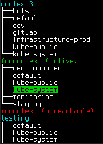

# kubeswitch
[](https://goreportcard.com/report/github.com/danielb42/kubeswitch) 
[](https://opensource.org/licenses/MIT)  

Switch your current kubernetes context and namespace graphically by selecting from a tree. kubeswitch talks to the kubernetes API and does not depend on kubectl. 

&nbsp;&nbsp;&nbsp;&nbsp;&nbsp;&nbsp;&nbsp;&nbsp;&nbsp;&nbsp;&nbsp;&nbsp;

## Install
```
GO111MODULE=on go get github.com/danielb42/kubeswitch/cmd/kubeswitch
```

**Note for Non-Admin Users:** If you are a cluster tenant without API-permission to list namespaces, kubeswitch won't work for you (as it can't retrieve available namespaces).  
~~Have a look at [kubeswitch-lite](https://github.com/danielb42/kubeswitch/tree/master/cmd/kubeswitch-lite), which does not discover namespaces but instead works on user-defined namespaces.~~ (Update 07/2020: Sorry, kubeswitch-lite is not available at the moment as the configuration process was quite error-prone (and thus a PITA for the user). It may come back some day.)

## Config
Read from the default location `~/.kube/config`. If not present, the location is read from environment variable `KUBECONFIG`. That can contain multiple locations separated by `:` from where configs are merged together.

## Run
| Run... | to... |
|-|-|
| `kubeswitch` | select context/namespace graphically |  
| `kubeswitch <namespace>` | switch to namespace in current context quickly |  
| `kubeswitch <context> <namespace>`<br>`kubeswitch <context>/<namespace>` | switch to context/namespace |
